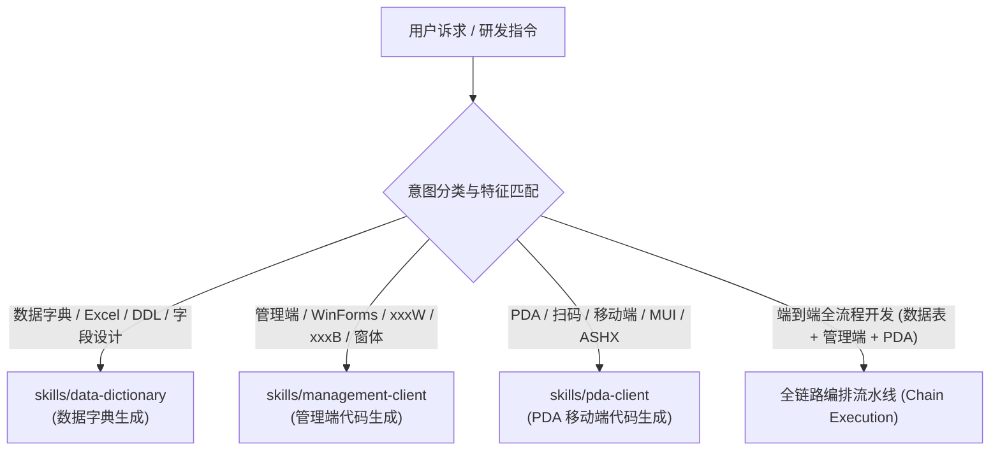
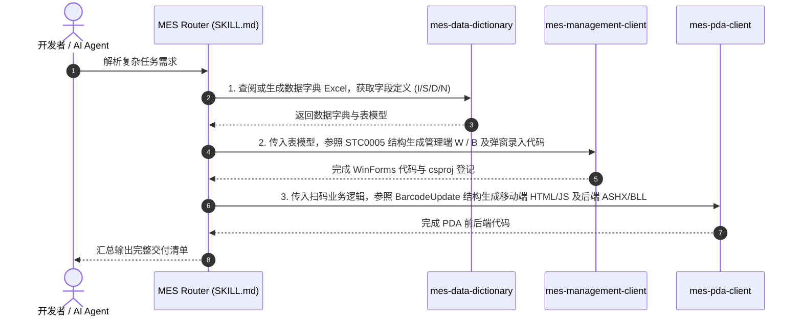

# 浦林成山 MES 研发智能工作流路由 (MES Workflow Router)

本技能作为浦林成山 MES 智能化开发的核心路由中枢（Router Orchestrator），负责接收并分析用户的开发诉求、数据表结构或业务需求，并分发/调度到对应的专用子技能，基于现有生产代码例子进行高保真代码和工程物料的生成。

---

## 1. 意图识别与路由决策表 (Routing Matrix)

当用户提出开发诉求时，AI 将提取意图特征并路由至对应的专业技能库：

| 意图分类 | 核心关键词 / 匹配特征 | 目标子技能 (Sub-Skill) | 输出物料 |
| :--- | :--- | :--- | :--- |
| **数据字典生成** | `数据字典`, `Excel`, `LTA1024`, `表结构`, `字段`, `DDL`, `建表`, `.xlsx`, `I/S/D/N` | [skills/data-dictionary](./skills/data-dictionary/SKILL.md) | 标准 Excel 数据字典文件、类型合规校验报告 |
| **管理端开发** | `管理端`, `WinForms`, `STC0005`, `xxxW.cs`, `xxxB.cs`, `LSDataGrid`, `FrmDialog`, `对话框`, `增删改查` | [skills/management-client](./skills/management-client/SKILL.md) | C# View/Designer/Bus 完整代码、对话框代码、csproj 登记项 |
| **PDA 移动开发** | `PDA`, `移动端`, `扫码`, `条码`, `MUI`, `ASHX`, `BLL`, `BarcodeUpdate`, `keyup` | [skills/pda-client](./skills/pda-client/SKILL.md) | HTML5/MUI 页面、JS 扫码脚本、C# ASHX 接口与 BLL 处理类 |
| **全链路协同** | `端到端`, `新建一个XX功能包含管理端和PDA`, `根据表结构完成全套开发` | 跨技能流水线 (1 $\to$ 2 $\to$ 3) | 数据字典 Excel + 管理端窗体 + PDA 扫码端完整套件 |

---

## 2. 专用子技能索引 (Sub-Skills Catalog)

### 2.1 [数据字典生成技能 (mes-data-dictionary)](./skills/data-dictionary/SKILL.md)
- **定位**：依照标杆文件 `LTA1024-静音棉计件表.xlsx` 规范，快速生成符合企业规范的 MES 数据字典 Excel。
- **关键资产**：
  - 模板：[`template.xlsx`](./skills/data-dictionary/templates/template.xlsx)
  - 转换器：[`generate_dict.py`](./skills/data-dictionary/scripts/generate_dict.py)（支持 JSON 与 SQL DDL 直转）
  - 校验器：[`verify_dict.py`](./skills/data-dictionary/scripts/verify_dict.py)
  - 规范库：[字段类型转换映射](./skills/data-dictionary/references/type-mapping.md)、[模块命名规约](./skills/data-dictionary/references/naming-convention.md)

### 2.2 [管理端代码生成技能 (mes-management-client)](./skills/management-client/SKILL.md)
- **定位**：为 `05-MES管理端` 生产标准的 C# WinForms 业务模块（基于生产示例 `STC0005`）。
- **关键资产**：
  - 主窗体模板：[`FormViewTemplate.cs`](./skills/management-client/templates/FormViewTemplate.cs) (单例/图标)、[`FormDesignerTemplate.cs`](./skills/management-client/templates/FormDesignerTemplate.cs)
  - 业务控制器：[`BusClassTemplate.cs`](./skills/management-client/templates/BusClassTemplate.cs) (CRUD、`LSDataGrid` 数据拦截)
  - 弹窗录入套件：[`DialogViewTemplate.cs`](./skills/management-client/templates/DialogViewTemplate.cs)、[`DialogBusTemplate.cs`](./skills/management-client/templates/DialogBusTemplate.cs)
  - 参考：[开发编码规范](./skills/management-client/references/coding-standards.md)、[API 字典](./skills/management-client/references/api-reference.md)

### 2.3 [PDA 移动端代码生成技能 (mes-pda-client)](./skills/pda-client/SKILL.md)
- **定位**：为 `03-PDA` 与 `04-服务器端程序` 生产手持终端扫码应用（基于生产示例 `BarcodeUpdate` 与 `LTA01.ashx`）。
- **关键资产**：
  - 前端视图：[`PdaPageTemplate.html`](./skills/pda-client/templates/PdaPageTemplate.html) (MUI 表单、导航栏、底部状态栏)
  - 交互脚本：[`PdaScriptTemplate.js`](./skills/pda-client/templates/PdaScriptTemplate.js) (扫码回车监听、mui.ajax、toast 提示)
  - 后端接口：[`AshxHandlerTemplate.ashx`](./skills/pda-client/templates/AshxHandlerTemplate.ashx)、[`BllClassTemplate.cs`](./skills/pda-client/templates/BllClassTemplate.cs)
  - 参考：[扫码交互规范](./skills/pda-client/references/pda-workflow.md)、[接口参考手册](./skills/pda-client/references/api-reference.md)

---

## 3. 端到端全链路执行示例 (Full-Stack Orchestration)

---

## 4. 未来技能扩展指南 (How to Add New Skills)

添加新技能（如报表看板、后台定时服务等）的标准化步骤：
1. **新建子技能目录**：在 `skills/` 下新建规范命名的文件夹（如 `skills/bi-report`、`skills/schedule-job`）。
2. **基于现有代码提取模板与参考**：放置真实生产代码提取出的 `templates/` 与 `references/`。
3. **编写子技能入口**：创建 `skills/{new-skill}/SKILL.md`，包含合法 YAML Frontmatter（`name`, `description`）。
4. **注册至主路由**：在主路由 `messkill/SKILL.md` 的意图路由表与子技能索引中加入对应项。
