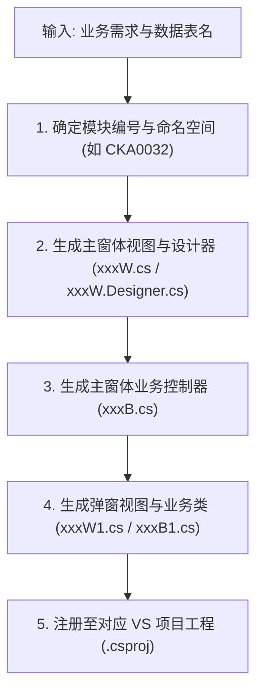

# MES 管理端代码生成技能 (MES Management Client Skill)

本技能用于为浦林成山 MES 管理端（`05-MES管理端`）快速生成符合企业三层架构规范的 C# WinForms 业务模块代码。

---

## 1. 架构模式与代码生成标准

MES 管理端采用**视图（VIEW）与业务（BUS）强解耦**设计：

| 文件类型 | 命名格式 | 继承基类 | 核心职能 |
| :--- | :--- | :--- | :--- |
| **主界面 View** | `{编号}W.cs` | `System.Windows.Forms.Form` | 单例模式 `Instance`、按钮图标初始化 `GetPic()` |
| **主界面 Designer**| `{编号}W.Designer.cs` | 部分类 (`partial`) | 控件布局（工具栏面板 `panel1`、表格 `GrdMain`） |
| **主界面 Bus** | `{编号}B.cs` | `MESService.BusniessClassBase` | 数据查询 `GetData`、增删改按钮响应、表格事件拦截 |
| **弹窗 View** | `{编号}W1.cs` | `UserControls.FrmDialog` | 对话框容器，接收外部传入的 `DataRow` |
| **弹窗 Bus** | `{编号}B1.cs` | `MESService.BusniessDialogClassBase` | 表单数据回填、录入校验、保存回传 |

---

## 2. 交互与代码生成流水线



### 步骤 1：确认模块编码与命名空间
- 依据业务领域确定前缀：
  - 成品检查：`CKA_VIEW` / `CKA_BUS`
  - 仓储与返回胶：`STE_VIEW` / `STE_BUS`
  - 基础数据：`EDA_VIEW` / `EDA_BUS`
  - 追溯业务：`LTA_VIEW` / `LTA_BUS`
- 确定 7 位编号（如 `CKA0032`）。

### 步骤 2：生成主窗体视图文件
基于模板 [`templates/FormViewTemplate.cs`](./templates/FormViewTemplate.cs) 和 [`templates/FormDesignerTemplate.cs`](./templates/FormDesignerTemplate.cs)：
- 确保包含单例方法 `public static {CODE}W Instance(IConfig Config)`。
- 确保 `FormClosed` 事件将单例 `instance = null` 彻底注销。
- 工具栏按钮采用 `UserControls.LSToolButton`，数据表采用 `UserControls.LSDataGrid`（名称必须为 `GrdMain`）。

### 步骤 3：生成业务控制器
基于模板 [`templates/BusClassTemplate.cs`](./templates/BusClassTemplate.cs)：
- 继承 `BusniessClassBase`。
- 实现 `Form_Load`、`GetData`、`BtnQuery_Click`、`BtnNew_Click`、`BtnEdit_Click`、`BtnDelete_Click`。
- 重点实现 `GrdMain_OnDataChange(object sender, LSDataRowEventArgs e)`：
  ```csharp
  if (e.ChangeType == ChangeType.New)
  {
      if (Config.FormService.ShowDialog(this.ViewForm.Text, "{PREFIX}_VIEW|{CODE}W1",
          "{PREFIX}_BUS|{CODE}B1", new object[] { e.Row }) == DialogResult.OK)
      {
          e.Row["UPTIM"] = TimeService.GetFrameDateTime();
          Config.DataBase.InsertRow("{TABLE_NAME}", e.Row);
      }
      else
      {
          e.Cancel = true;
      }
  }
  ```

### 步骤 4：生成弹窗录入视图与控制器
基于模板 [`templates/DialogViewTemplate.cs`](./templates/DialogViewTemplate.cs) 与 [`templates/DialogBusTemplate.cs`](./templates/DialogBusTemplate.cs)：
- 在 `Form_Load` 中完成下拉框绑定和老数据回填。
- 在 `BtnOK_Click` 中执行前后端防错校验，阻止非法数据入库。

---

## 3. 编码规范守则
1. **禁止直接写死 SQL 连接字符串**：必须统一通过 `Config.DataBase` 或 `Config.DataBaseList["..."]` 操作。
2. **禁止依赖客户端本地时钟**：时间字段统一调用 `TimeService.GetFrameDateTime()`。
3. **友好异常提示**：捕获异常后统一调用 `MessageService.ShowError("提示信息: " + ex.Message)`，禁止静默吞掉异常。
4. **登录人审计跟踪**：维护人字段统一从 `Config.DataList["mEmployeeName"]` 取值。
