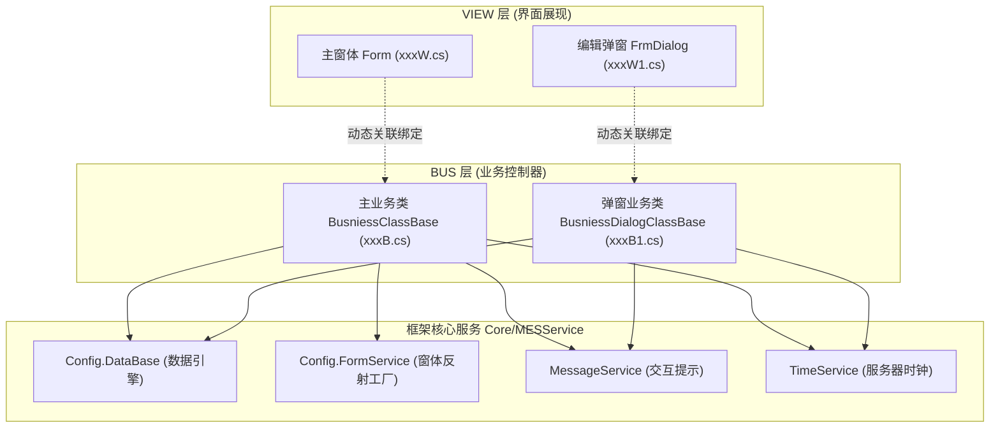

# MES 管理端开发规范与架构设计 (WinForms / .NET)

本规范适用于浦林成山 MES 管理端（`05-MES管理端`）的业务功能开发与代码生成。

---

## 1. 架构分层体系 (3-Tier Decoupled Architecture)

MES 管理端采用严格的**视图与业务逻辑解耦**设计：



### 核心命名规约
- 模块命名空间：`{模块前缀}_VIEW` 与 `{模块前缀}_BUS`，如 `CKA_VIEW` 与 `CKA_BUS`、`STE_VIEW` 与 `STE_BUS`。
- 主功能编号：统一为 7 位（如 `CKA0032`、`STE0024`）。
- 主窗体文件：
  - View：`{编号}W.cs`、`{编号}W.Designer.cs`、`{编号}W.resx`
  - Business：`{编号}B.cs`
- 弹窗文件：
  - 新增/修改弹窗：`{编号}W1.cs`、`{编号}B1.cs`
  - 批量导入/特殊弹窗：`{编号}W2.cs`、`{编号}B2.cs`

---

## 2. 视图层 (VIEW) 核心设计规范

### 单例模式与生命周期
主窗体必须实现静态单例 `Instance(IConfig Config)`，并在窗体关闭事件 `FormClosed` 中清空实例：
```csharp
public partial class CKA0032W : Form
{
    private IConfig config;
    public CKA0032W(IConfig Config)
    {
        InitializeComponent();
        this.config = Config;
        GetPic(); // 动态加载按钮图标
    }

    private static CKA0032W instance = null;
    public static CKA0032W Instance(IConfig Config)
    {
        if (instance == null) instance = new CKA0032W(Config);
        return instance;
    }

    private void CKA0032W_FormClosed(object sender, FormClosedEventArgs e)
    {
        instance = null;
    }

    public void GetPic()
    {
        foreach (Control col in panel1.Controls)
        {
            if (col is LSToolButton btn)
            {
                btn.SelectedImage = config.ImageFactory.GetImage(btn.Title, true);
                btn.Image = config.ImageFactory.GetImage(btn.Title, false);
            }
        }
    }
}
```

### 界面核心控件类型
- 工具栏按钮：`UserControls.LSToolButton`（属性：`Title="查询"`, `ShowText=true`）
- 数据表格：`UserControls.LSDataGrid`（属性：`Name="GrdMain"`）
- 弹窗按钮：`UserControls.LSButton`（`BtnOK`, `BtnCancel`）
- 对话框基类：继承 `UserControls.FrmDialog`，具备系统标准标题栏与按钮样式。

---

## 3. 业务层 (BUS) 核心设计规范

### 主业务类基类：`BusniessClassBase`
1. 控件通过 `GetControlByName("控件名")` 强转获取。
2. 覆写标准生命周期与操作按钮：
   - `Form_Load(object sender, EventArgs e)`：初始化下拉框数据、设置默认日期，执行初次查询 `GetData()`。
   - `BtnQuery_Click(object sender, EventArgs e)`：根据筛选条件检索。
   - `BtnNew_Click`：调用 `GrdMain.NewRow()`。
   - `BtnEdit_Click`：调用 `GrdMain.EditRow()`。
   - `BtnDelete_Click`：选中校验、确认弹窗后调用 `GrdMain.DeleteRow()`。
   - `GrdMain_OnDataChange(object sender, LSDataRowEventArgs e)`：接管 `New` / `Edit` / `Delete` 变更，通过反射打开弹窗 `FormService.ShowDialog(...)`，校验后持久化至数据库。

### 弹窗业务类基类：`BusniessDialogClassBase`
1. 接收传入的 `DataRow`（`this.GetPropertieByName("Row") as DataRow`）。
2. 在 `Form_Load` 中为各文本框、下拉框、时间控件回填数据。
3. 在 `BtnOK_Click` 中执行前后端规则校验（如总数校验、必填校验），通过后赋值回 `DataRow` 并调用 `base.BtnOK_Click(sender, e)`。

---

## 4. 数据库持久化规范

1. **SQL 参数与防错**：
   - 优先使用参数化或安全格式化查询。
   - 涉及多工厂统一使用 `storage["FAC"]` 或过滤条件 `FAC IN (...)`。
   - 涉及工厂时间统一从 `TimeService.GetFrameDateTime()` 获取。
2. **并发与日志**：
   - 更新或插入成功后，建议记录业务日志 `config.Logger.Info(...)`。
   - 异常处理统一包裹 `try...catch`，并在发生不可逆错误时使用 `MessageService.ShowError(...)` 友好提示。
