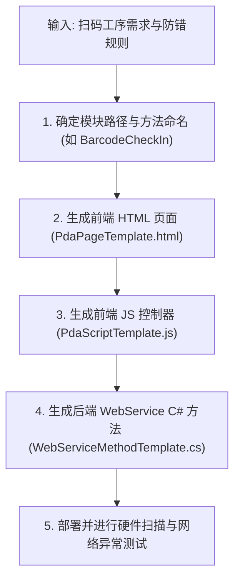

# MES PDA 移动端代码生成技能 (MES PDA Client Skill)

本技能用于为浦林成山 MES 移动手持扫码终端（`03-MES-PDA` / `04-MES-PDA-NEW`）快速生成符合现场硬件操作特性的 HTML5/MUI 前端页面、交互脚本及后端 C# ASMX WebService 接口方法。

---

## 1. PDA 架构模式与代码生成标准

MES PDA 采用**前后端轻量级 RPC 架构**：

| 文件类型 | 典型路径 / 命名格式 | 框架 / 依赖 | 核心职能 |
| :--- | :--- | :--- | :--- |
| **PDA 视图 (HTML)** | `view/{module}/{CODE}.html` | HTML5 + MUI | 标题栏回退导航、扫码输入区、信息明细卡片、操作按钮栏 |
| **PDA 控制器 (JS)** | `js/{module}/{CODE}.js` | MUI + jQuery | 硬件扫描头监听 (Enter/13)、前后端防错校验、音效触发、页面数据局部更新 |
| **后端服务 (WebService)** | `PDAWebService.asmx.cs` | C# .NET ASMX | 接收统一 JSON 参数包 `{MethodName, Params}`，工序防错校验，事务入库 |

---

## 2. 代码生成流水线 (Step-by-Step Workflow)

### 步骤 1：梳理扫码业务规则
- **条码类型**：硫化胎胚条码、半部件台车条码、返回胶标签条码、库位码等。
- **校验逻辑**：条码格式与长度校验、防重复扫描、当前状态/工序防呆（如非本工序、已报废、已出库拦截）。
- **提交参数**：固定首两位为 `FAC`、`LOGINNAME`，其余为条码值与表单输入项。

### 步骤 2：生成 HTML 页面
基于模板 [`templates/PdaPageTemplate.html`](./templates/PdaPageTemplate.html)：
- 引用 MUI 基础样式与脚本 (`mui.min.css`, `mui.min.js`)。
- 扫码输入框设置 `autofocus` 和对应语义的 `placeholder`。
- 预置成功提示音 (`success.mp3`) 与报警蜂鸣音 (`error.mp3`) 标签。
- 关键状态以徽标或卡片形式展示（如绿标“合格”、红标“异常”）。

### 步骤 3：生成 JS 控制器
基于模板 [`templates/PdaScriptTemplate.js`](./templates/PdaScriptTemplate.js)：
- 监听硬件扫码头按键事件（兼容 `13`、`0`、`229` 键码）。
- 提交前拦截：空值检查、最短长度检查、高频连续触发拦截（防连扫）。
- 统一通过 `mui.ajax` 或封装好的 RPC 函数向后端发送数据。
- 无论成功或报错，必须保证**输入框光标复位 (`input.select()` / `input.focus()`)**。
- 业务异常必须触发**报警音效**与高亮红框提示。

### 步骤 4：生成后端 WebService 方法
基于模板 [`templates/WebServiceMethodTemplate.cs`](./templates/WebServiceMethodTemplate.cs)：
- 使用 `[WebMethod]` 注解。
- 统一参数规约：解析前端传入的 `ArrayList` 或 `string[]`。
- 数据库操作严格依赖 `Config.DataBase`，涉及多表写入必须启用事务 (`BeginTransaction` / `Commit` / `RollBack`)。
- 时间字段统一使用 `TimeService.GetFrameDateTime()`。
- 返回标准化 JSON 数据包：`{ status: "ok"|"error", msg: "...", data: { ... } }`。

---

## 3. 现场终端核心守则 (Field Operation Rules)

1. **零鼠标/零手触交互设计**：
   - 工人佩戴手套操作，界面应支持纯扫码触发提交，不能强制要求点按“确定”按钮。
2. **光标永远不丢失 (Focus Retention)**：
   - 任何一次扫码（即使服务端校验报错）后，必须通过 `setTimeout` 或回调立即夺回输入框焦点。
3. **声光双重防错 (Audio & Visual Feedback)**：
   - 现场噪音极大，报错时必须伴随蜂鸣音 + 界面震动/红色闪烁。
4. **会话持久化与离线感知**：
   - 工厂信息及登录人必须来自 `localStorage`。遇到网络超时必须明确提示“网络连接中断，请重试”，禁止无限假死转圈。
