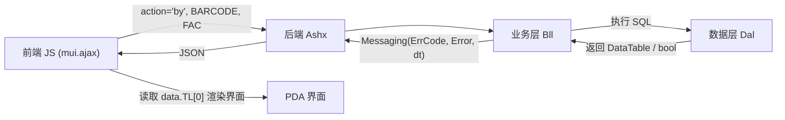

# MES PDA 移动端接口与通信参考

本文档基于 `03-PDA` 与 `04-服务器端程序/LonSon.Mobile.PrinxChengShan.App.Web` 实际代码提炼。

> **核心原则**：**严禁建立实体类！** 后端一律直接使用 SQL 查出 `DataTable`，或直接使用 `string`，通过统一结构 `Messaging<string>` 序列化返回。

---

## 1. 前后端数据交互全貌



---

## 2. 后端取数与返回方式 (DataTable & 字符串)

系统内置了通用通信载体类 `Mobile.PrinxChengShan.Model.Messaging<T>`，定义如下：
- `ErrCode` (string)：状态码，`"0"` 成功，`"1"` 业务提示/未找到，`"500"` 系统异常；
- `Error` (string)：提示文本或错误消息；
- `TL` (DataTable)：**主结果数据表**；
- `TB` (DataTable)：次结果数据表（可选）。

### 场景 A：查询数据并返回数据表 (DataTable $\to$ 前端 `data.TL`)
```csharp
// 1. DAL 层直接通过 SQL 返回 DataTable（不建任何 Model/实体类）
DataTable dt = dal.GetBarcodeQueryData(barcode, fac);

// 2. BLL 层直接包装入 Messaging 并序列化
if (dt != null && dt.Rows.Count > 0)
{
    // 第三个参数传入 DataTable dt，框架自动映射到 TL 并转为 JSON 数组
    return JsonHelper<Messaging<string>>.EntityToJson(new Messaging<string>("0", "查询成功", dt));
}
else
{
    return JsonHelper<Messaging<string>>.EntityToJson(new Messaging<string>("1", "未找到条码信息！"));
}
```

### 场景 B：提交保存并返回字符串提示 (string $\to$ 前端 `data.Error`)
```csharp
bool success = dal.UpdateData(barcode, fac, loginName, qty);
if (success)
{
    return JsonHelper<Messaging<string>>.EntityToJson(new Messaging<string>("0", "操作成功！"));
}
else
{
    return JsonHelper<Messaging<string>>.EntityToJson(new Messaging<string>("1", "提交失败，请重试！"));
}
```

### 场景 C：捕获异常返回异常字符串
```csharp
catch (Exception ex)
{
    SystemErrorPlug.ErrorRecord(ex.ToString());
    return JsonHelper<Messaging<string>>.EntityToJson(new Messaging<string>("500", ex.Message.Trim().Replace("\r\n", "")));
}
```

---

## 3. 前端 JS 解析数据表与字符串

```javascript
mui.ajax(requestPath + '/ashx/{MODULE}.ashx', {
    data: {
        action: "by",
        Token: storage["Token"],
        FAC: storage["FAC"],
        LOGINNAM: storage["LOGINNAME"],
        ENAM: storage["NAME"],
        BARCODE: barcode,
        lang: storage["Language"]
    },
    dataType: 'json',
    type: 'post',
    timeout: 100000,
    success: function(data) {
        // 1. 状态判断
        if (data.ErrCode == "0") {
            // 2. 接收并读取 DataTable 数据行 (data.TL)
            if (data.TL && data.TL.length > 0) {
                var row = data.TL[0];
                mui('#txtBARCODE')[0].value = row.BARCODE || "";
                mui('#txtITNBR')[0].value = row.BUITNBR || "";
                mui('#txtITDSC')[0].value = row.BUITDSC || "";
                mui('#txtQTY')[0].value = row.QTY || "1";
            }
        } else {
            // 3. 读取提示/错误字符串 (data.Error)
            mui.toast(data.Error || "查询无数据！");
        }
    },
    error: function(xhr, type) {
        mui.alert("网络请求异常: " + type);
    }
});
```
