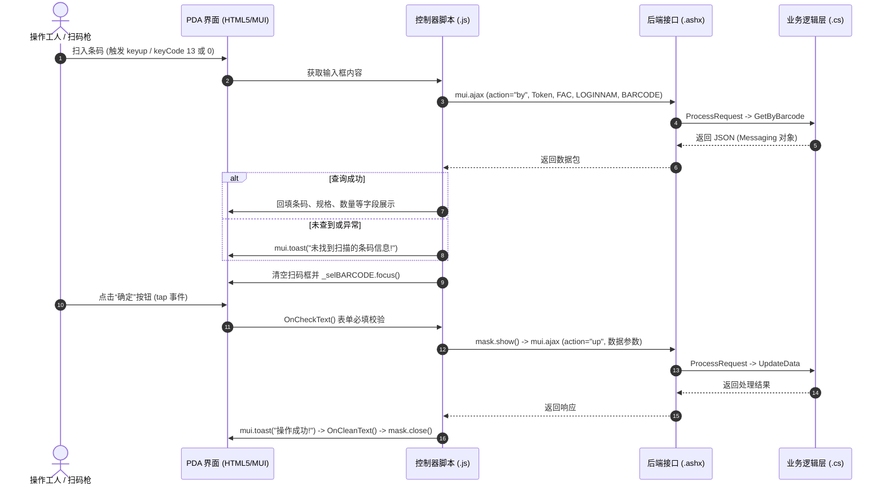

# MES PDA 移动端工作流参考

本规范基于 `03-PDA` 与 `04-服务器端程序/LonSon.Mobile.PrinxChengShan.App.Web` 实际代码提炼。

---

## 1. 业务交互流程

以 `Forming/BarcodeUpdate.html` 与 `js/BarCodeUpdate.js` 为标准案例：



---

## 2. 核心代码规范

### 1. 扫码框按键监听
扫码输入框绑定 `keyup` 事件，拦截 `13`（回车）与 `0`（部分扫码头）：
```javascript
var _selBARCODE = mui('#selBARCODE')[0];
_selBARCODE.focus();

_selBARCODE.addEventListener('keyup', function() {
    if (13 == event.keyCode || 0 == event.keyCode) {
        var barcodeVal = _selBARCODE.value.trim();
        if (barcodeVal.length >= 6) {
            queryBarcodeInfo(barcodeVal);
        }
    }
    _selBARCODE.focus();
}, false);
```

### 2. 本地会话变量
PDA 登录后将用户信息存储于 `window.localStorage`：
- `storage["Token"]`：接口身份验证令牌
- `storage["FAC"]`：所属工厂代码（如 "02"）
- `storage["FACNM"]`：工厂名称
- `storage["NAME"]`：员工姓名
- `storage["LOGINNAME"]`：员工工号
- `storage["Language"]`：多语言环境代码（如 "CHN", "ENG", "THAI"）

### 3. 数据提交与提示
- 请求前使用 `mask.show()` 开启遮罩防止重复提交，响应后调用 `mask.close()`。
- 轻量提示使用 `mui.toast(msg, { duration: tim, type: 'div' })`。
- 警告/错误弹窗使用 `mui.alert(msg, "Message")`。
