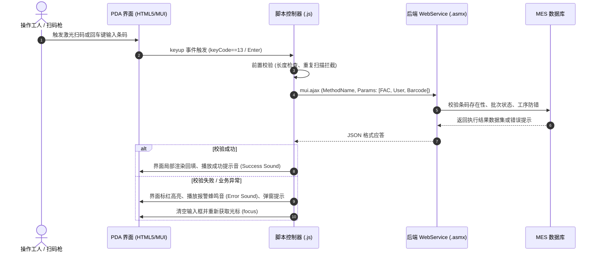

# MES PDA 移动扫码端工作流与业务规范

本规范详细定义浦林成山 MES 移动端（PDA 扫码终端）的业务生命周期、人机交互与后端交互规范。

---

## 1. PDA 业务扫码全生命周期



---

## 2. 交互与硬件适配规范

### 1. 硬件扫码监听机制
PDA 红外/激光扫描头在扫入条码后，默认会模拟物理键盘发送 `Enter`（键值 13）或特定按键事件（0 或 229）。
前端必须在扫码输入框上绑定 `keyup` 事件：
```javascript
var inputBarcode = mui('#BARCODE')[0];
inputBarcode.focus();

inputBarcode.addEventListener('keyup', function(event) {
    if (13 === event.keyCode || 0 === event.keyCode || 229 === event.keyCode) {
        var codeVal = inputBarcode.value.trim();
        if (codeVal.length >= 6) {
            handleScanBarcode(codeVal);
        }
    }
});
```

### 2. 扫码后光标复位与选中 (Focus Retention)
在提交处理完成或提示错误后，必须立即调用 `input.select()` 或 `input.focus()`，确保操作人员无需手动点击屏幕即可连续扫描下一件产品。

### 3. 会话变量与班次绑定
PDA 运行于离线或移动网络环境，登录信息保存在 `localStorage` 中：
- `storage["FAC"]`：所属工厂代码（如 "02"）
- `storage["LOGINNAME"]`：登录工号
- `storage["NAME"]`：登录员工姓名
- `storage["SHIFT"]`：当前班次
- `storage["WDATE"]`：当前工厂日期
所有提交到 WebService 的接口参数数组首两位固定为 `FAC` 与 `LOGINNAME`。
